# flutter_table_layout

**Adaptive data tables for Flutter.** One widget gives you a dense data grid on desktop and web, and expandable cards on phones. It comes with search, date and custom filters, sorting, pagination, selection, summaries, Excel / Word / PDF export, printing, auto-generated CRUD forms, five themes, and full RTL (Arabic) support.

The grid also covers the "spreadsheet" features: **frozen columns, sticky header with virtualized rows (100k+ rows), column resize and drag & drop reorder, a per-column filter row, multi-column sort, row grouping, inline cell editing, keyboard navigation, and server-side data sources.**

<p align="center">
  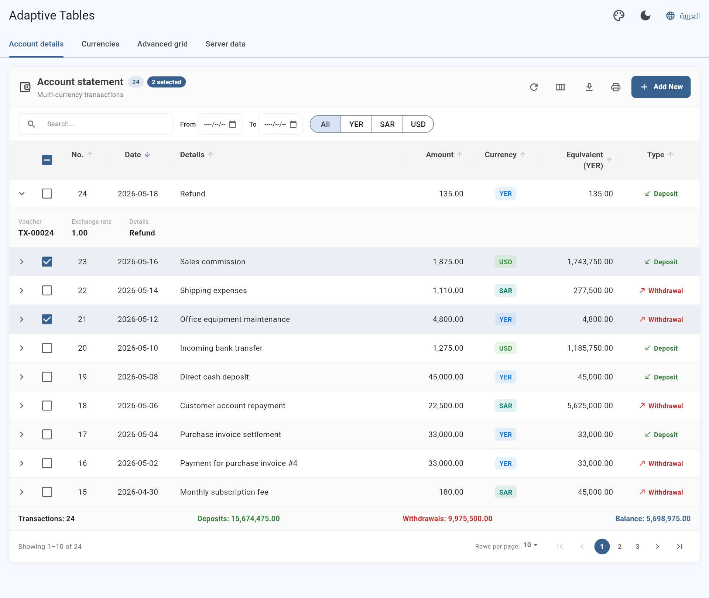
</p>

<p align="center">
  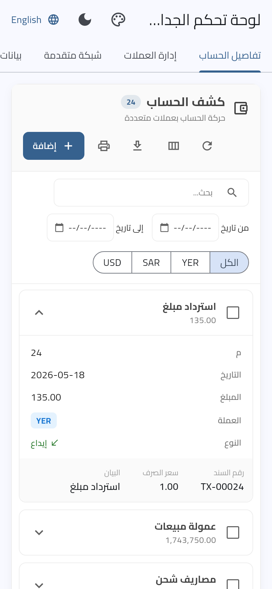
  &nbsp;
  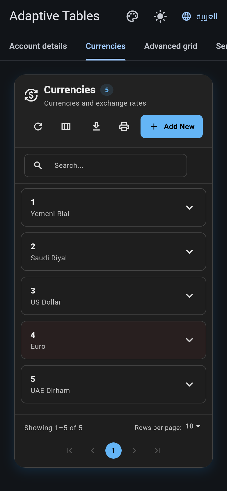
</p>

---

## Contents

- [Features](#features)
- [Installation](#installation)
- [Quick start](#quick-start)
- [Columns](#columns)
- [Search, filters and sorting](#search-filters-and-sorting)
- [Pagination](#pagination)
- [Selection, row taps and expandable rows](#selection-row-taps-and-expandable-rows)
- [Summary row](#summary-row)
- [Controlling the table from outside](#controlling-the-table-from-outside)
- [Loading and empty states](#loading-and-empty-states)
- [Layout mode (grid or cards)](#layout-mode-grid-or-cards)
- [Advanced grid](#advanced-grid)
  - [Sticky header and virtualization](#sticky-header-and-virtualization-large-data)
  - [Frozen columns](#frozen-columns)
  - [Resize and reorder columns](#resize-and-reorder-columns)
  - [Per-column filter row](#per-column-filter-row)
  - [Multi-column sort](#multi-column-sort)
  - [Row grouping](#row-grouping)
  - [Inline cell editing](#inline-cell-editing)
  - [Keyboard navigation](#keyboard-navigation)
  - [Server-side data](#server-side-data)
- [Export and printing](#export-and-printing)
- [Dynamic forms (CRUD)](#dynamic-forms-crud)
- [Hiding features and permissions](#hiding-features-and-permissions)
- [Themes](#themes)
- [Localization and RTL](#localization-and-rtl)
- [Comparison with other packages](#comparison-with-other-packages)
- [API reference](#api-reference)
- [Using the logic without the UI](#using-the-logic-without-the-ui)
- [Running the example and tests](#running-the-example-and-tests)
- [بالعربية](#بالعربية)

---

## Features

| | |
|---|---|
| 📱 **Adaptive layout** | Data grid above `mobileBreakpoint` (600 px by default). Below it, rows become expandable cards. Horizontal scrolling kicks in when the columns don't fit. |
| 🔎 **Search** | Debounced, case-insensitive search over visible and searchable columns. Dates also match `yyyy-MM-dd`. |
| 📅 **Filters** | Inclusive date range with a "Query" button mode, your own filter widgets (`customFilters`), and a "Clear filters" button. |
| ↕️ **Sorting** | Stable sort. Numbers, strings (case-insensitive), dates and booleans compare naturally, and `null` always sorts last. |
| 📄 **Pagination** | Numbered pages, a rows-per-page menu, "Showing 11–20 of 48". The current page is clamped automatically when data shrinks. |
| ☑️ **Selection** | Row checkboxes, a tri-state *select all*, `onSelectionChanged`, and a selection badge. Exports use only the selected rows when there are any. |
| 🧩 **Expandable rows** | `expandedRowBuilder` adds a details panel on desktop and mobile. |
| 🧮 **Summary row** | `summaryBuilder` receives every filtered row, across all pages. |
| 📤 **Export** | Excel `.xlsx` with typed cells, Word `.doc`, PDF (auto landscape, Arabic font), and system printing. Web downloads the file, mobile opens the share sheet, desktop saves to Downloads. |
| 📝 **Dynamic forms** | Generate add/edit dialogs from your columns, with validation and typed values. |
| 🎨 **Themes** | `adaptive`, `light`, `dark`, `glassmorphic`, `gradient`, `cozy`. It's a `ThemeExtension`, so you can register it once for the whole app. |
| 🌍 **i18n and RTL** | English and Arabic built in, every string can be overridden, and layout, alignment and icons mirror in RTL. |
| 🧊 **Frozen columns** | Pin columns at the start or end (`pin: ColumnPin.start`); users can pin from the columns menu. LTR and RTL. |
| 🚀 **Large data** | `bodyHeight` / `fillHeight`: sticky header and lazily built rows. Tested with 100,000 rows. |
| ↔️ **Column layout** | Resize by dragging the header edge (double-click resets), reorder by long-press + drag, "Reset columns". |
| 🧪 **Column filters** | A filter row under the header: `text`, `=x`, `!=x`, `>10`, `<=5`, `10..20`, `a, b`, dates `>=2026-01-01`. |
| 🔢 **Multi-sort** | Shift + click adds secondary sort levels, shown as 1, 2, 3 in the header. |
| 🗂️ **Grouping** | `groupByColumnId`, collapsible groups, per-group aggregates via `groupHeaderBuilder`. |
| ✏️ **Inline editing** | Double-click or Enter to edit text, number, dropdown, date or boolean cells, with validation and per-cell permissions. |
| ⌨️ **Keyboard** | Arrows, Enter/F2, Tab, Space, Home/End, Page Up/Down, Ctrl+A, Escape. |
| ☁️ **Server-side** | `AdaptiveTableDataSource`: search, filters, sort and paging are sent to your API. Stale responses are ignored. |
| 🕹️ **Controller** | `AdaptiveTableController` to search, filter, sort, paginate and select from anywhere. |

## Installation

```yaml
dependencies:
  flutter_table_layout: ^0.1.0
```

```bash
flutter pub get
```

Requires Flutter ≥ 3.35 / Dart ≥ 3.9.

> **Platform notes**
> - **macOS**: printing and saving files need the sandbox entitlements
>   `com.apple.security.print` and `com.apple.security.files.downloads.read-write`.
> - **Android / iOS**: exports open the native share sheet (`share_plus`).
> - **Web**: exports download directly in the browser.

## Quick start

```dart
import 'package:flutter/material.dart';
import 'package:flutter_table_layout/flutter_table_layout.dart';

class Invoice {
  final int id;
  final String customer;
  final double total;
  final DateTime date;
  final bool paid;
  const Invoice(this.id, this.customer, this.total, this.date, this.paid);
}

class InvoicesPage extends StatelessWidget {
  const InvoicesPage({super.key, required this.invoices});
  final List<Invoice> invoices;

  @override
  Widget build(BuildContext context) {
    return Scaffold(
      body: SingleChildScrollView(
        child: AdaptiveTableLayout<Invoice>(
          title: 'Invoices',
          subtitle: 'All invoices of the current year',
          items: invoices,
          columns: [
            AdaptiveTableColumn(id: 'id', title: '#', width: 70),
            AdaptiveTableColumn(id: 'customer', title: 'Customer', flex: 2),
            AdaptiveTableColumn(
              id: 'total',
              title: 'Total',
              alignment: TableColumnAlignment.end,
              valueFormatter: (v) => '\$${(v as double).toStringAsFixed(2)}',
            ),
            AdaptiveTableColumn(id: 'date', title: 'Date', width: 120),
            AdaptiveTableColumn(
              id: 'paid',
              title: 'Status',
              width: 110,
              cellBuilder: (context, inv) => Chip(
                label: Text(inv.paid ? 'Paid' : 'Open'),
              ),
            ),
          ],
          // One extractor per column id. Used for search, sort and export.
          valueProviders: {
            'id': (i) => i.id,
            'customer': (i) => i.customer,
            'total': (i) => i.total,
            'date': (i) => i.date,
            'paid': (i) => i.paid ? 'Paid' : 'Open',
          },
          dateProvider: (i) => i.date, // enables the From / To filter
        ),
      ),
    );
  }
}
```

> 💡 `items` may be a new list or the same list changed in place. Either way the table refreshes on the next rebuild.

## Columns

`AdaptiveTableColumn<T>` describes one column:

| Property | Default | Description |
|---|---|---|
| `id` | *required* | Unique key. It must match the key in `valueProviders`. |
| `title` | *required* | Header text. Single words are never split mid-word, they shrink to fit instead. |
| `fieldName` | `id` | Field name, used by the dynamic form type detection. |
| `width` / `flex` | `null` / `1` | Fixed width, or a flex share of the remaining space. |
| `alignment` | `start` | `start`, `center` or `end`. Direction-aware, so `end` is the left edge in RTL. |
| `cellBuilder` | `null` | Custom cell widget. |
| `headerBuilder` | `null` | Custom header widget. |
| `valueFormatter` | `null` | Formats the raw value for text cells, mobile cards and PDF/Word exports. Excel keeps the raw typed value. |
| `isSortable` | `true` | Tapping the header toggles ascending / descending. |
| `isVisible` | `true` | Initial visibility. Users can still toggle it from the columns menu. |
| `isHideable` | `true` | Whether users may hide the column. The last visible column can never be hidden. |
| `isSearchable` | `true` | Include in global search. |
| `isExportable` | `true` | Include in exports and printing. Set `false` for action columns. |
| `pin` | `ColumnPin.none` | Freeze at the `start` or `end` (desktop grid). |
| `minWidth` | `60` | Smallest width when resizing or squeezing. |
| `isResizable` | `true` | Allow resizing by dragging the header edge. |
| `isFilterable` | `true` | Show a field in the per-column filter row. |
| `isEditable` | `false` | Allow inline editing (with `onCellEdited`). |
| `editor` | inferred | `CellEditor.text / number / dropdown(options) / date / boolean`. |
| `cellValidator` | `null` | Validates inline edits. Return an error message to keep the editor open. |

```dart
AdaptiveTableColumn<Currency>(
  id: 'actions',
  title: 'Actions',
  width: 130,
  isSortable: false,
  isSearchable: false,
  isExportable: false, // not written to Excel / PDF / Word
  cellBuilder: (context, c) => Row(
    mainAxisSize: MainAxisSize.min,
    children: [
      IconButton(icon: const Icon(Icons.edit), onPressed: () => edit(c)),
      IconButton(icon: const Icon(Icons.delete), onPressed: () => delete(c)),
    ],
  ),
),
```

<p align="center">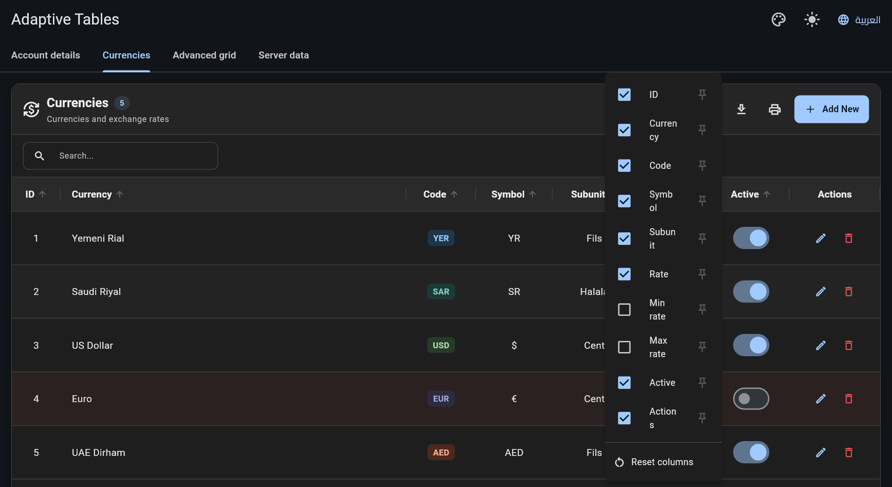</p>

## Search, filters and sorting

```dart
AdaptiveTableLayout<Transaction>(
  // …
  showSearch: true,                          // default
  searchDebounce: const Duration(milliseconds: 250),
  dateProvider: (t) => t.date,               // shows From / To pickers
  firstDate: DateTime(2020), lastDate: DateTime(2030),
  onQueryPressed: () {},                     // optional: apply dates only on "Query"
  initialSortColumnId: 'date',
  initialSortAscending: false,

  // Custom filters: any widget, plus a matcher.
  customFilterMatcher: (t, filters) =>
      filters['currency'] == null || t.currency == filters['currency'],
  customFilters: const [CurrencyFilter()],
)
```

A custom filter widget is built under the table, so it can talk to the table directly:

```dart
class CurrencyFilter extends StatelessWidget {
  const CurrencyFilter({super.key});

  @override
  Widget build(BuildContext context) {
    final cubit = context.watch<TableCubit<Transaction>>();
    final current = cubit.tableState.customFilters['currency'] as String?;
    return SegmentedButton<String>(
      segments: const [
        ButtonSegment(value: 'all', label: Text('All')),
        ButtonSegment(value: 'USD', label: Text('USD')),
        ButtonSegment(value: 'SAR', label: Text('SAR')),
      ],
      selected: {current ?? 'all'},
      onSelectionChanged: (s) =>
          cubit.setCustomFilter('currency', s.first == 'all' ? null : s.first),
    );
  }
}
```

> Value providers whose key doesn't match any column are **search-only keys**. For example, `'tags': (t) => t.tags.join(' ')` makes tags searchable without showing a column.

## Pagination

```dart
AdaptiveTableLayout<T>(
  pageSizes: const [10, 25, 50, 100],
  initialPageSize: 25,
  showPagination: true, // false = render every row, no footer
)
```

## Selection, row taps and expandable rows

```dart
AdaptiveTableLayout<Transaction>(
  showSelection: true,
  onSelectionChanged: (rows) => setState(() => selected = rows),
  onRowTap: (t) => openDetails(t),          // when null, a tap expands the row
  onRowLongPress: (t) => showMenu(t),
  rowColorBuilder: (t) => t.isOverdue ? Colors.red.withValues(alpha: .06) : null,
  expandedRowBuilder: (context, t) => TransactionDetails(t),
  mobileTitleColumnId: 'details',           // card title on phones
  mobileSubtitleColumnId: 'amount',         // card subtitle on phones
)
```

## Summary row

`summaryBuilder` receives **all filtered rows**, not only the current page:

```dart
summaryBuilder: (context, rows) {
  final total = rows.fold<double>(0, (s, r) => s + r.amount);
  return Text('Total: ${total.toStringAsFixed(2)}');
},
```

## Controlling the table from outside

```dart
final controller = AdaptiveTableController<Invoice>();

AdaptiveTableLayout<Invoice>(controller: controller, /* … */);

controller.search('acme');
controller.setDateRange(DateTime(2026, 1, 1), null);
controller.setCustomFilter('status', 'open');
controller.sortBy('total', ascending: false);
controller.goToPage(2);
controller.setColumnVisibility('notes', false);
controller.selectAll();
controller.setColumnFilter('total', '>100');
controller.addSort('date');                  // secondary sort level
controller.groupBy('customer');
controller.setColumnPin('customer', ColumnPin.start);
controller.refresh();                        // reload (server mode)

final rows = controller.filteredItems;   // all pages, filtered and sorted
final picked = controller.selectedItems;
controller.resetFilters();
```

The controller is a `ChangeNotifier`, so `ListenableBuilder(listenable: controller, …)` rebuilds on every table change. Use `onTableStateChanged` to persist the search/sort/page state, or to drive server-side queries.

## Loading and empty states

```dart
AdaptiveTableLayout<T>(
  isLoading: isFetching,            // spinner, or a progress bar over existing rows
  loadingWidget: const MyShimmer(),
  emptyWidget: const MyEmptyState(), // otherwise "No data" / "No results"
)
```

If a value provider throws, the table shows an error message instead of crashing, and recovers on the next change.

## Layout mode (grid or cards)

```dart
AdaptiveTableLayout<T>(
  layoutMode: TableLayoutMode.auto,  // default: cards below mobileBreakpoint
  // layoutMode: TableLayoutMode.table, // always the grid (scrolls horizontally on phones)
  // layoutMode: TableLayoutMode.cards, // always cards, even on desktop
  mobileBreakpoint: 700,             // only used by `auto`
)
```

The toolbar and footer always adapt to the available width, whatever the mode.

## Advanced grid

<p align="center">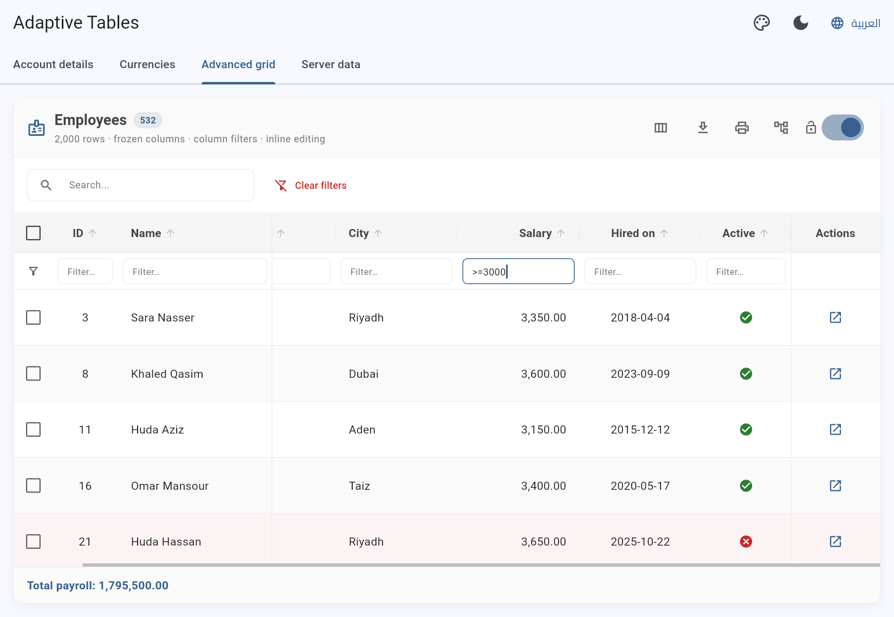</p>

Everything below works on desktop and web. On phones the same table switches to cards, with grouping and virtualization still working.

### Sticky header and virtualization (large data)

Give the rows a bounded height and only the visible rows are built, while the header stays on top:

```dart
// A fixed rows area…
AdaptiveTableLayout<Employee>(
  items: employees,            // e.g. 100,000 rows
  showPagination: false,       // one long, lazily built list
  bodyHeight: 520,
  columns: columns,
  valueProviders: providers,
)

// …or fill the parent (Expanded, SizedBox, a TabBarView page…)
Expanded(
  child: AdaptiveTableLayout<Employee>(
    fillHeight: true,
    items: employees,
    columns: columns,
    valueProviders: providers,
  ),
)
```

`fillHeight` is ignored (with a debug message) when the parent height is unbounded, for example inside a `SingleChildScrollView`.

### Frozen columns

```dart
AdaptiveTableColumn(id: 'id', title: 'ID', width: 80, pin: ColumnPin.start),
AdaptiveTableColumn(id: 'name', title: 'Name', width: 200, pin: ColumnPin.start),
// … scrollable columns …
AdaptiveTableColumn(id: 'actions', title: 'Actions', width: 110, pin: ColumnPin.end),
```

- Pinned columns stay visible while the other columns scroll horizontally. `start` and `end` follow the text direction.
- The selection and expand columns are always pinned.
- Users can pin or unpin any column from the 📌 button in the columns menu, or you can call `controller.setColumnPin('city', ColumnPin.start)`.

### Resize and reorder columns

- **Resize:** drag the right edge of a header. Double-click the edge to restore the declared width.
- **Reorder:** long-press a header, then drag it onto another header.
- **Reset:** the columns menu has a "Reset columns" item, or call `controller.resetColumnLayout()`.

```dart
AdaptiveTableLayout<T>(
  allowColumnResize: true,   // default
  allowColumnReorder: true,  // default
  columns: [
    AdaptiveTableColumn(id: 'notes', title: 'Notes', minWidth: 120),
    AdaptiveTableColumn(id: 'actions', title: '', isResizable: false),
  ],
)
// From code:
controller.setColumnWidth('notes', 300);
controller.moveColumn('salary', beforeColumnId: 'name');
```

### Per-column filter row

```dart
AdaptiveTableLayout<T>(showColumnFilters: true, /* … */)
```

| Type in a column filter | Keeps rows where the value… |
|---|---|
| `acme` | contains "acme" (case-insensitive) |
| `=paid` / `!=paid` | equals / differs |
| `!test` | does not contain "test" |
| `>1000`, `>=1000`, `<50`, `<=50` | compares as a number, date or text |
| `100..500` | is within the range (inclusive) |
| `>=2026-01-01` | is on or after a date |
| `USD, SAR` | matches any of the parts (OR) |

Column filters combine with each other and with the search box using AND. Set `isFilterable: false` to skip a column. From code: `controller.setColumnFilter('salary', '>=3000')`. The expressions are also sent to your server in `TableStateModel.columnFilters`.

### Multi-column sort

Click a header to sort, and **Shift + click** other headers to add secondary sort levels, shown as 1, 2… next to the arrow. From code:

```dart
controller.setSorts(const [ColumnSort('department'), ColumnSort('salary', ascending: false)]);
controller.addSort('name');
```

### Row grouping

<p align="center">
  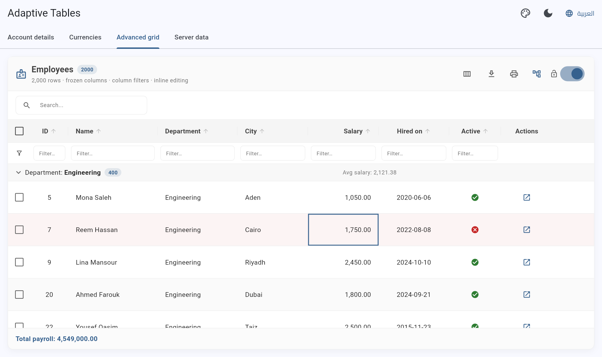
  &nbsp;
  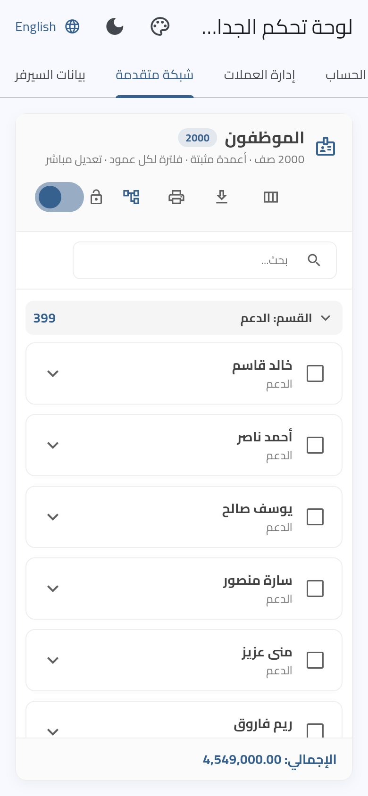
</p>

```dart
AdaptiveTableLayout<Employee>(
  groupByColumnId: 'department',               // or controller.groupBy('city')
  groupHeaderBuilder: (context, group) => Text(
    'Avg: ${group.rows.map((e) => e.salary).reduce((a, b) => a + b) / group.rows.length}',
  ),
)
```

- Click a group header to collapse or expand it.
- `group.rows` holds every row of the group across all pages, so aggregates cover the whole group.
- Rows are ordered by the group column first, then by the user's sort.

### Inline cell editing

```dart
AdaptiveTableLayout<Employee>(
  items: employees,
  columns: [
    AdaptiveTableColumn(id: 'name', title: 'Name', isEditable: true,
        cellValidator: (v) => (v as String).trim().isEmpty ? 'Required' : null),
    AdaptiveTableColumn(id: 'salary', title: 'Salary', isEditable: true), // number editor (inferred)
    AdaptiveTableColumn(id: 'dept', title: 'Department', isEditable: true,
        editor: const CellEditor.dropdown(['Sales', 'IT', 'HR'])),
    AdaptiveTableColumn(id: 'hiredOn', title: 'Hired', isEditable: true), // date picker (inferred)
    AdaptiveTableColumn(id: 'active', title: 'Active', isEditable: true), // toggles on double-click
  ],
  // Permissions: per row / per column.
  canEditCell: (e, column) => user.canEdit && e.isActive,
  // Save the change. Return false (or throw) to reject it.
  onCellEdited: (e, column, value) async {
    final ok = await api.update(e.id, {column: value});
    if (ok) setState(() => employees = [for (final x in employees) x.id == e.id ? x.copyWith(column, value) : x]);
    return ok;
  },
)
```

| Action | Result |
|---|---|
| Double-click, Enter or F2 | Start editing |
| Enter | Save |
| Tab / Shift+Tab | Save and edit the next / previous cell |
| Escape | Cancel |
| Click outside | Save |

The editor is inferred from the value (`num` → number, `DateTime` → date picker, `bool` → toggle, otherwise text) unless you set `editor`. Numbers accept `1,250.5`. Invalid values keep the editor open with an error.

### Keyboard navigation

Click a cell, then:

| Key | Action |
|---|---|
| ← → ↑ ↓ | Move between cells (mirrored in RTL) |
| Enter / F2 | Edit, or run `onRowTap` / expand the row |
| Space | Select the row |
| Home / End (+Ctrl) | First / last column (row) |
| Page Up / Page Down | Previous / next page |
| Ctrl/Cmd + A | Select all |
| Escape | Leave the cell |

Turn it off with `enableKeyboardNavigation: false`.

### Server-side data

<p align="center">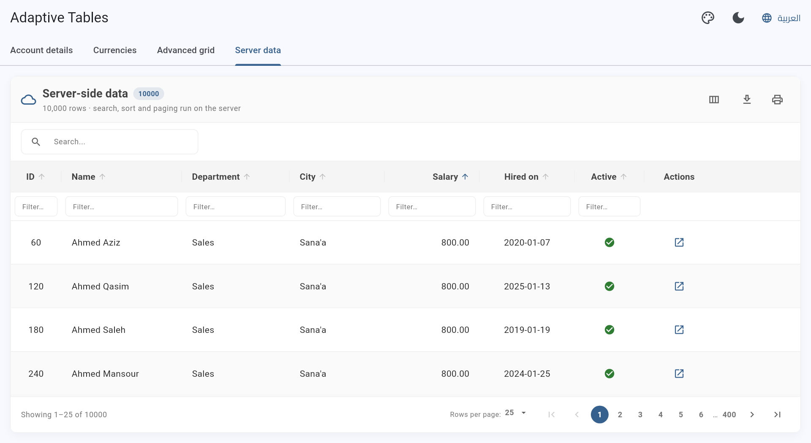</p>

```dart
class _InvoicesState extends State<InvoicesPage> {
  // Create the source once, not in build().
  late final source = AdaptiveTableDataSource<Invoice>.fromCallback((q) async {
    final res = await api.getInvoices(
      page: q.currentPage,
      size: q.pageSize,
      search: q.searchQuery,
      sort: [for (final s in q.sorts) '${s.columnId}:${s.ascending ? 'asc' : 'desc'}'],
      filters: q.columnFilters,   // {'total': '>100', 'status': '=paid'}
      from: q.startDate, to: q.endDate,
    );
    return TableDataPage(items: res.items, totalCount: res.total);
  });

  @override
  Widget build(BuildContext context) => AdaptiveTableLayout<Invoice>(
    dataSource: source,            // `items` is not needed
    columns: columns,
    valueProviders: providers,
    showColumnFilters: true,
    fillHeight: true,
  );
}
```

- Every change to the search, filters, sort, page or page size calls `fetch`.
- A progress bar shows while a request is in flight, and out-of-order responses are ignored.
- On error, the table shows a **Retry** button (`controller.refresh()` also reloads).
- If the server has fewer pages than the current page, the table moves to the last page automatically.
- Selection and exports work on the rows of the current page. Use `onExportRequested` for server-side exports.
- **Tip:** `FilterItemsUseCase` is pure Dart, so your Dart backend can run exactly the same filtering and sorting.

## Export and printing

The toolbar has **Excel**, **Word**, **PDF** and **Print** actions. Exports:

- respect the current search, filters and sort order;
- export **only the selected rows** when some are selected (`exportSelectedWhenAny`);
- skip hidden columns and columns with `isExportable: false`;
- escape HTML in the Word output, and use safe file and sheet names, including Arabic titles;
- save the file where it belongs: a browser download on web, the share sheet on mobile, and `~/Downloads` on desktop (with a snackbar showing the path).

```dart
AdaptiveTableLayout<T>(
  exportOptions: TableExportOptions(
    fileName: 'statement_2026',
    formats: {ExportFormat.excel, ExportFormat.pdf},
    pdfFont: myRegularFont,       // pw.Font.ttf(await rootBundle.load('assets/Cairo-Regular.ttf'))
    pdfBoldFont: myBoldFont,
    pdfPageFormat: PdfPageFormat.a4.landscape,
    // Handle the bytes yourself (upload, e-mail…) instead of saving:
    onExport: (format, bytes, fileName) async => upload(bytes, fileName),
  ),
)
```

**Use your own export or print** (for example your company PDF template). The table gives you the rows it would export: the selected rows if any, otherwise all filtered rows, in the current sort order.

```dart
AdaptiveTableLayout<Invoice>(
  onExportRequested: (format, rows) async {
    if (format == ExportFormat.pdf) {
      final bytes = await MyInvoicePdf.build(rows);
      await saveAndShareFile(bytes: bytes, fileName: 'invoices.pdf',
          mimeType: format.mimeType);
    }
  },
  onPrintRequested: (rows) => MyPrinter.print(rows),
)
```

> **Arabic PDFs offline:** by default the Cairo font is downloaded from Google Fonts once, then cached. Offline apps should bundle a font and pass `pdfFont`.

The exporters also work on their own:

```dart
final bytes = await const ExcelExporter().generateExcel<Invoice>(
  sheetName: 'Invoices',
  columns: columns.map((c) => c.definition).toList(),
  items: invoices,
  valueProviders: providers,
);
await saveAndShareFile(bytes: bytes, fileName: 'invoices.xlsx',
    mimeType: ExportFormat.excel.mimeType);
```

## Dynamic forms (CRUD)

<p align="center">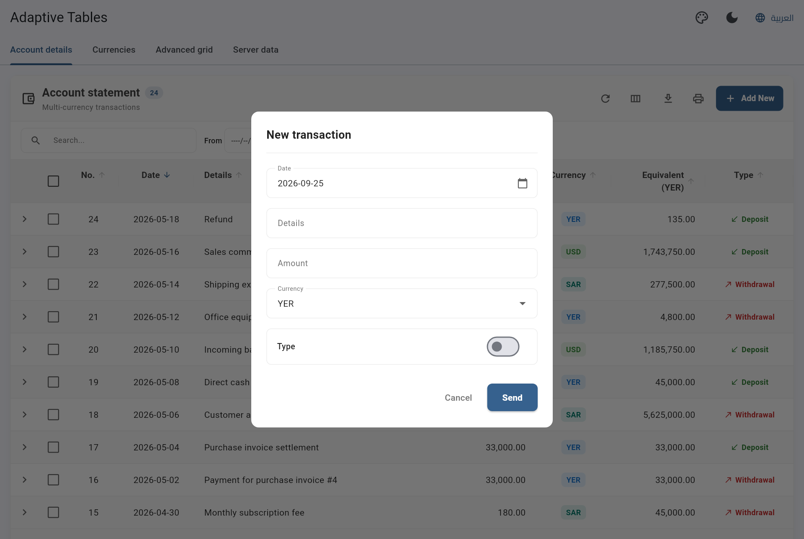</p>

Generate a form from your columns and get typed values back:

```dart
final values = await DynamicFormDialog.show(
  context,
  title: 'New transaction',
  fields: DynamicFormField.detectFromColumns(
    columns,
    dropdownItems: {'currency': ['YER', 'SAR', 'USD']},
    excludeIds: {'id', 'actions'},
    initialValues: {'currency': 'USD'},      // e.g. when editing
    fieldTypes: {'status': FieldType.text},  // override the detection
  ),
);
if (values != null) {
  // values['amount'] is num?, values['date'] is DateTime, values['paid'] is bool…
}
```

**Type detection** works on whole words of `fieldName` / `id` (`createdAt`, `created_at` and `Created At` all split into *created* + *at*):

| Detected type | Matches | Widget | Value |
|---|---|---|---|
| `boolean` | starts with `is`/`has`/`can`/`should`/`allow`, or contains `active`, `enabled`, `status`, `visible` | `SwitchListTile` | `bool` |
| `date` | contains `date`, `day`, `time`, `birthday`, `dob`, or ends with `at`/`on` | date picker | `DateTime` |
| `number` | contains `id`, `amount`, `price`, `rate`, `total`, `qty`, `count`, `balance`, `discount`, … | numeric field | `num?` (`null` if left empty) |
| `dropdown` | column listed in `dropdownItems` | `DropdownButtonFormField` | `String?` |
| `text` | anything else | `TextFormField` | `String?` |

Manual fields support `validator` (called for every type), `hint`, `helperText`, `enabled`, `maxLines`, `firstDate` and `lastDate`:

```dart
DynamicFormField(
  id: 'email',
  label: 'E-mail',
  type: FieldType.text,
  isRequired: true,
  hint: 'name@company.com',
  validator: (v) => (v as String?)?.contains('@') == true ? null : 'Invalid e-mail',
),
```

## Hiding features and permissions

Every part of the table can be turned off, and a button whose callback is `null` is not shown. So permissions are just values:

```dart
final canEdit = user.can('invoices.edit');

AdaptiveTableLayout<Invoice>(
  showSearch: true,
  showDateFilter: false,                    // hide the From / To pickers
  showExport: user.can('invoices.export'),
  showPrint: user.can('invoices.print'),
  showSelection: canEdit,
  showColumnsToggle: true,
  showPagination: true,
  showSummary: user.can('invoices.totals'),
  showClearFilters: true,
  onAddNewPressed: user.can('invoices.create') ? openMyAddDialog : null,
  onRefreshPressed: reload,
  exportOptions: const TableExportOptions(formats: {ExportFormat.excel}), // only Excel
  columns: [
    // …
    if (canEdit)
      AdaptiveTableColumn(
        id: 'actions', title: 'Actions', width: 130,
        isSortable: false, isSearchable: false, isExportable: false,
        cellBuilder: (context, inv) => Row(mainAxisSize: MainAxisSize.min, children: [
          IconButton(icon: const Icon(Icons.edit), onPressed: () => openMyEditDialog(inv)),
          if (user.can('invoices.delete'))
            IconButton(icon: const Icon(Icons.delete), onPressed: () => delete(inv)),
        ]),
      ),
  ],
  onRowTap: canEdit ? openMyEditDialog : null,
)
```

- The filter bar disappears when search, the date filter and custom filters are all off.
- The toolbar disappears when there is no title and no action.
- `onAddNewPressed` can open **any** dialog or page, so `DynamicFormDialog` is optional.
- Sensitive columns: include them only when allowed (`if (user.isAdmin) AdaptiveTableColumn(...)`), or use `isHideable: false` / `isExportable: false`.

## Themes

| Glassmorphic | Gradient | Cozy |
|---|---|---|
| 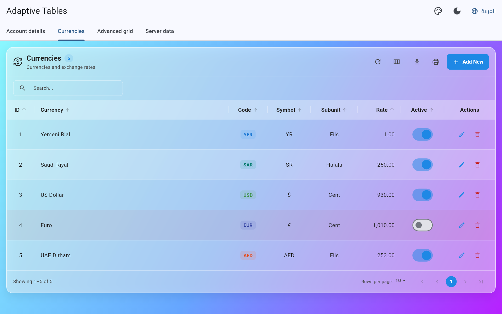 | 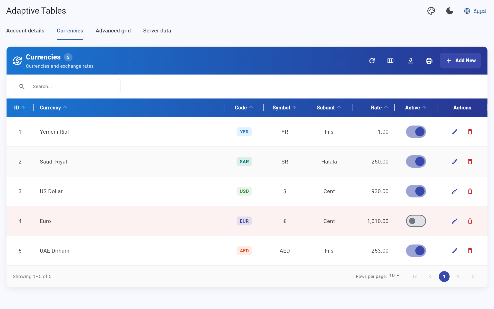 | 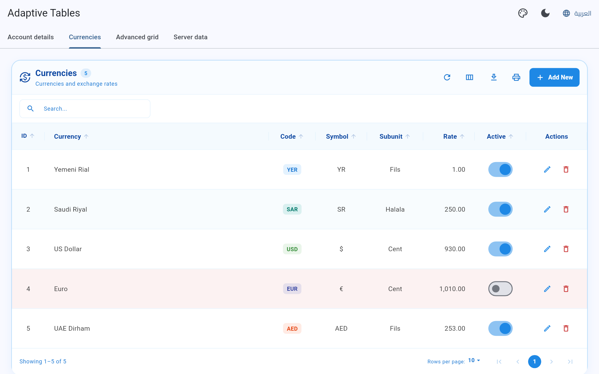 |

```dart
AdaptiveTableTheme.adaptive(context)          // default: follows light/dark + colorScheme.primary
AdaptiveTableTheme.light(context, accentColor: Colors.teal)
AdaptiveTableTheme.dark(context)
AdaptiveTableTheme.glassmorphic(context, isDark: true) // place over an image/gradient
AdaptiveTableTheme.gradient(context, gradient: myGradient)
AdaptiveTableTheme.cozy(context)

// Tweak any preset:
AdaptiveTableTheme.light(context).copyWith(
  borderRadius: BorderRadius.circular(4),
  useAlternateRows: false,
  accentColor: Colors.deepPurple,
)
```

Register a theme once for the whole app. It also animates between light and dark:

```dart
MaterialApp(
  theme: ThemeData(extensions: [myTableTheme]),
)
```

Main theme properties: `cardBackgroundColor`, `borderRadius`, `cardBorder`, `cardShadow`, `cardMargin`, `toolbarBackgroundColor`, `headerBackgroundColor`, `headerTextStyle`, `titleTextStyle`, `rowBackgroundColor`, `alternateRowBackgroundColor`, `useAlternateRows`, `rowTextStyle`, `rowPadding`, `rowHoverColor`, `selectedRowColor`, `dividerColor`, `footerBackgroundColor`, `footerTextStyle`, `summaryBackgroundColor`, `accentColor`, `onAccentColor`, `actionIconColor`, `toolbarIconColor`, `statusPositiveColor`, `statusNegativeColor`, `headerGradient`, `footerGradient`, `enableGlassmorphism`, `blurSigma`.

## Localization and RTL

<p align="center">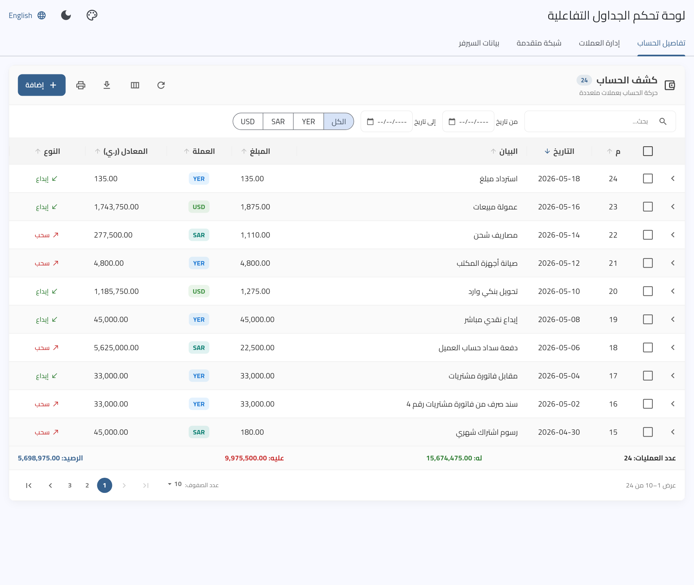</p>

- Labels come from `AdaptiveTableLabels.of(context)`: Arabic when the app locale is `ar`, English otherwise.
- Pass `labels: AdaptiveTableLabels.en.copyWith(search: 'Buscar…', …)` (or a whole new `AdaptiveTableLabels`) for any other language.
- The older `searchHint`, `dateFromLabel`, `dateToLabel` and `queryButtonLabel` parameters still work and override the labels.
- In RTL, the layout, column alignments, pagination arrows and expand icons are mirrored, Excel sheets are right-to-left, and Word/PDF documents use `dir="rtl"`.

## Comparison with other packages

✅ built in · 🟡 partial / needs extra work · ❌ not available. The other packages' columns are based on their public documentation. Check their latest versions before deciding.

| Feature | **flutter_table_layout** | PlutoGrid / TrinaGrid | Syncfusion DataGrid | data_table_2 | PaginatedDataTable |
|---|---|---|---|---|---|
| License | **MIT (free)** | MIT | Commercial (free community license with conditions) | MIT | Flutter SDK |
| Automatic mobile cards layout | ✅ | ❌ | ❌ | ❌ | ❌ |
| Arabic / RTL with ready-made labels | ✅ | 🟡 | 🟡 | 🟡 | 🟡 |
| Global search box | ✅ | ✅ | 🟡 | ❌ | ❌ |
| Date-range filter | ✅ | 🟡 | 🟡 | ❌ | ❌ |
| Per-column filter row | ✅ | ✅ | ✅ | ❌ | ❌ |
| Multi-column sort | ✅ | ✅ | ✅ | ❌ | ❌ |
| Pagination | ✅ | ✅ | ✅ | ✅ | ✅ |
| Virtualized rows / sticky header | ✅ | ✅ | ✅ | ✅ | ❌ |
| Frozen columns (start / end) | ✅ | ✅ | ✅ | 🟡 (start) | ❌ |
| Resize / reorder columns | ✅ | ✅ | ✅ | ❌ | ❌ |
| Row grouping | ✅ | ✅ | ✅ | ❌ | ❌ |
| Inline cell editing | ✅ | ✅ | ✅ | ❌ | ❌ |
| Keyboard navigation | ✅ | ✅ | ✅ | ❌ | ❌ |
| Server-side data source | ✅ | ✅ | ✅ | ✅ | 🟡 |
| Excel + Word + PDF export, print | ✅ built in | 🟡 add-on | 🟡 add-on | ❌ | ❌ |
| Auto-generated add / edit forms | ✅ | ❌ | ❌ | ❌ | ❌ |
| Summary row + group aggregates | ✅ | ✅ | ✅ | ❌ | ❌ |
| Ready-made themes | ✅ 6 | ✅ | ✅ | 🟡 | 🟡 |
| External controller | ✅ | ✅ | ✅ | 🟡 | 🟡 |

**Where this package is stronger:** it's the only one that turns into cards on phones automatically, it ships Arabic out of the box, exports to Excel, Word and PDF and prints without add-ons, and generates CRUD forms from your columns. All of that sits in one MIT-licensed widget, with the same API on phone, tablet, desktop and web.

**Where the others are still ahead:** Excel-style clipboard copy/paste, multi-cell range selection, row drag & drop, stacked (multi-level) headers, tree data, and cell merging. These are not implemented here yet.

## API reference

### `AdaptiveTableLayout<T>`

| Parameter | Type | Default | Description |
|---|---|---|---|
| `items` | `List<T>` | required | Rows. |
| `columns` | `List<AdaptiveTableColumn<T>>` | required | Column schema. |
| `valueProviders` | `Map<String, dynamic Function(T)>` | required | Values per column id (search / sort / export). |
| `dateProvider` | `DateTime? Function(T)?` | `null` | Enables the date filter. |
| `customFilterMatcher` | `bool Function(T, Map<String, dynamic>)?` | `null` | Applies `customFilters` values. |
| `customFilters` | `List<Widget>?` | `null` | Extra filter widgets. |
| `controller` | `AdaptiveTableController<T>?` | `null` | External control. |
| `title` / `subtitle` / `titleIcon` | | `null` | Toolbar header. |
| `toolbarActions` | `List<Widget>?` | `null` | Extra toolbar buttons. |
| `onRefreshPressed` / `onAddNewPressed` / `onQueryPressed` | `VoidCallback?` | `null` | Toolbar callbacks. |
| `showSearch` / `showSelection` / `showExport` / `showPrint` / `showColumnsToggle` / `showPagination` / `showSummary` / `showClearFilters` | `bool` | `true` | Feature switches. |
| `showDateFilter` | `bool?` | `dateProvider != null` | Show the date pickers. |
| `pageSizes` / `initialPageSize` | `List<int>` / `int?` | `[5,10,20,50]` / `10` | Pagination. |
| `initialSortColumnId` / `initialSortAscending` | | `null` / `true` | Initial sort. |
| `summaryBuilder` | `Widget Function(BuildContext, List<T>)?` | `null` | Summary row. |
| `expandedRowBuilder` | `Widget Function(BuildContext, T)?` | `null` | Row details panel. |
| `onRowTap` / `onRowLongPress` | `ValueChanged<T>?` | `null` | Row gestures. |
| `onSelectionChanged` | `ValueChanged<List<T>>?` | `null` | Selection updates. |
| `onTableStateChanged` | `ValueChanged<TableStateModel>?` | `null` | Search / filter / sort / page updates. |
| `rowColorBuilder` | `Color? Function(T)?` | `null` | Per-row background. |
| `layoutMode` | `TableLayoutMode` | `auto` | `auto`, `table` (always grid), `cards` (always cards). |
| `mobileBreakpoint` / `minDesktopWidth` | `double` | `600` / `800` | Layout thresholds. |
| `onExportRequested` / `onPrintRequested` | callbacks | `null` | Replace the built-in export / print with your own. |
| `dataSource` | `AdaptiveTableDataSource<T>?` | `null` | Server-side mode (`items` not needed). |
| `bodyHeight` / `fillHeight` | `double?` / `bool` | `null` / `false` | Sticky header + virtualized rows. |
| `showColumnFilters` | `bool` | `false` | Filter row under the header. |
| `allowColumnResize` / `allowColumnReorder` | `bool` | `true` / `true` | Column layout by the user. |
| `enableKeyboardNavigation` | `bool` | `true` | Keyboard control of the grid. |
| `groupByColumnId` / `groupHeaderBuilder` | | `null` | Row grouping and group aggregates. |
| `onCellEdited` / `canEditCell` | callbacks | `null` | Inline editing and per-cell permission. |
| `minRowHeight` | `double` | `0` | Minimum desktop row height. |
| `mobileTitleColumnId` / `mobileSubtitleColumnId` | `String?` | first / second column | Card title and subtitle. |
| `theme` / `labels` | | `AdaptiveTableTheme.of` / `AdaptiveTableLabels.of` | Styling and strings. |
| `searchDebounce` | `Duration` | `250ms` | Search delay. |
| `firstDate` / `lastDate` | `DateTime?` | 1900 / 2200 | Date picker range. |
| `exportOptions` | `TableExportOptions` | defaults | Export configuration. |
| `isLoading` / `loadingWidget` / `emptyWidget` | | `false` / `null` / `null` | States. |

## Using the logic without the UI

The domain layer is plain Dart and can be used anywhere, for example on a server:

```dart
final result = const FilterItemsUseCase().apply<Invoice>(
  items: invoices,
  columns: const [ColumnDefinition(id: 'customer', title: 'Customer')],
  state: const TableStateModel(searchQuery: 'acme', sortByColumnId: 'total',
      sortAscending: false, currentPage: 1, pageSize: 20),
  valueProviders: {'customer': (i) => i.customer, 'total': (i) => i.total},
);
print('${result.totalCount} rows, ${result.totalPages} pages');
```

`TableCubit<T>` holds the reactive state (via `flutter_bloc`) if you want to build your own UI.

## Running the example and tests

```bash
cd example && flutter run            # android / ios / web / windows / macos / linux
flutter test                          # from the package root
```

The screenshots in this README are generated from the example app:

```bash
cd example
flutter test test/screenshots_test.dart --update-goldens \
  --dart-define=SCREENSHOTS=true --dart-define=ARABIC_FONT_DIR=/path/to/cairo
```

---

## بالعربية

**flutter_table_layout** مكتبة جداول ذكية لـ Flutter. تعرض البيانات كجدول كامل على الكمبيوتر والويب، وتحوّلها تلقائياً إلى بطاقات قابلة للتوسيع على الجوال. تدعم العربية واتجاه RTL بالكامل.

**أهم المزايا:** (ومعها تثبيت الأعمدة، والتعديل المباشر، والتجميع، والفلترة لكل عمود، والبيانات من السيرفر)
- بحث فوري، وفلترة بالتاريخ (من / إلى)، وفلاتر مخصصة، وزر لمسح الفلاتر.
- فرز ثابت يفهم الأرقام والنصوص والتواريخ، وترقيم صفحات بأرقام وعدد صفوف قابل للتغيير.
- تحديد الصفوف مع استدعاء `onSelectionChanged`، وصفوف قابلة للتوسيع لعرض التفاصيل، وصف ملخص للإجماليات.
- تصدير إلى Excel وWord وPDF (بخط عربي) وطباعة مباشرة. عند تحديد صفوف يُصدَّر المحدد منها فقط، ولا تُصدَّر الأعمدة المخفية.
- نماذج إضافة وتعديل تُولَّد تلقائياً من الأعمدة مع التحقق من الإدخال.
- ستة أنماط تصميم (تلقائي، فاتح، داكن، زجاجي، متدرج، مريح) قابلة للتعديل بـ `copyWith`.
- نصوص عربية وإنجليزية جاهزة تُختار حسب لغة التطبيق، ويمكن تخصيص أي نص.
- متحكم `AdaptiveTableController` للتحكم بالجدول من خارجه.

**مثال سريع:**

```dart
AdaptiveTableLayout<Transaction>(
  title: 'كشف الحساب',
  items: transactions,
  columns: [
    AdaptiveTableColumn(id: 'date', title: 'التاريخ', width: 120),
    AdaptiveTableColumn(id: 'details', title: 'البيان', flex: 2),
    AdaptiveTableColumn(id: 'amount', title: 'المبلغ',
        alignment: TableColumnAlignment.end),
  ],
  valueProviders: {
    'date': (t) => t.date,
    'details': (t) => t.details,
    'amount': (t) => t.amount,
  },
  dateProvider: (t) => t.date,
  summaryBuilder: (context, rows) =>
      Text('الإجمالي: ${rows.fold<double>(0, (s, t) => s + t.amount)}'),
)
```

لتظهر النصوص بالعربية، اضبط لغة التطبيق على `ar` (مع `flutter_localizations`)، أو مرّر `labels: AdaptiveTableLabels.ar`.

**ميزات الشبكة المتقدمة (باختصار):**

| الميزة | طريقة الاستخدام |
|---|---|
| تثبيت أعمدة | `pin: ColumnPin.start` أو `ColumnPin.end` في العمود، أو زر 📌 في قائمة الأعمدة |
| بيانات ضخمة مع رأس ثابت | `bodyHeight: 500` أو `fillHeight: true` مع `showPagination: false` |
| تغيير عرض الأعمدة وترتيبها | اسحب حافة رأس العمود، أو اضغط مطولاً على الرأس واسحبه |
| فلتر لكل عمود | `showColumnFilters: true`، ثم اكتب مثلاً `>1000` أو `100..500` أو `=مدفوع` |
| فرز بأكثر من عمود | Shift + نقر على رؤوس الأعمدة |
| تجميع الصفوف | `groupByColumnId: 'department'` و`groupHeaderBuilder` للإجماليات |
| التعديل المباشر | `isEditable: true` في العمود + `onCellEdited` + `canEditCell` للصلاحيات |
| لوحة المفاتيح | الأسهم وEnter وTab وEsc وSpace |
| بيانات من السيرفر | `dataSource: AdaptiveTableDataSource.fromCallback((q) async => ...)` |

دليل الاستخدام الكامل بالعربية في [`doc/USAGE_AR.md`](doc/USAGE_AR.md).

---

## License

MIT. See [LICENSE](LICENSE).
